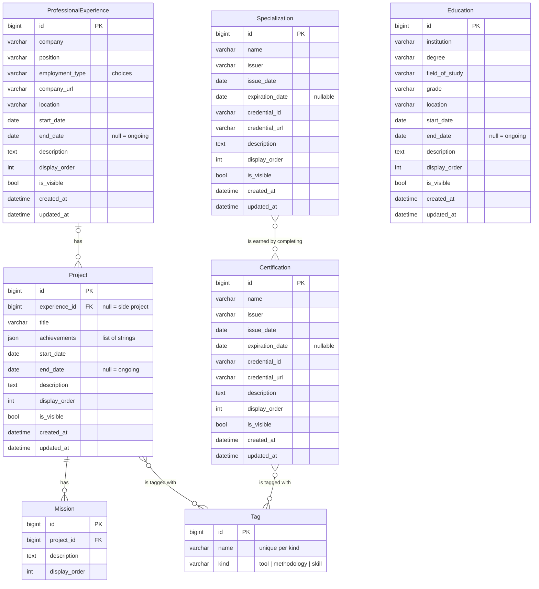

# Database

All models live in the `experience` app ([`experience/models.py`](../experience/models.py)).
Django prefixes table names with the app label (e.g. `experience_project`).

## Entity-relationship diagram



Many-to-many relationships are stored in join tables that Django creates
automatically (`experience_project_tags`, `experience_certification_tags`,
`experience_specialization_certifications`).

## Tags: tools, methodologies and skills

Tools, methodologies and skills are all rows of the single `Tag` table,
told apart by `kind`. `Tool`, `Methodology` and `Skill` are Django
[proxy models](https://docs.djangoproject.com/en/stable/topics/db/models/#proxy-models):
they have no table of their own, their queries only return tags of their kind,
and saving one sets `kind` automatically.

```python
Tool.objects.create(name="Docker")                    # stored with kind="tool"
Tool.objects.all()                                    # tools only
project.tags.filter(kind=Tag.Kind.SKILL)              # a project's skills
Tag.objects.get(name="Scrum").certifications.all()    # certifications about Scrum
```

## Abstract base classes

These classes hold shared fields and have no table of their own. Each concrete
model gets its own copy of the fields.

| Base | Fields | Used by |
|---|---|---|
| `BaseEntry` | `description`, `display_order`, `is_visible`, `created_at`, `updated_at` | every entry below |
| `DateRangeEntry` (extends `BaseEntry`) | `start_date`, `end_date` | `Education`, `ProfessionalExperience`, `Project` |
| `CredentialEntry` (extends `BaseEntry`) | `name`, `issuer`, `issue_date`, `expiration_date`, `credential_id`, `credential_url` | `Certification`, `Specialization` |

## Design decisions

- **Education, certifications and professional experience are separate tables.**
  Each kind of entry has its own fields, so a single table with a `type` column
  would leave most columns empty.
- **A null `end_date` means the entry is ongoing.** There is no separate flag to
  keep in sync; the `is_current` property is computed from it.
- **Specializations are their own table.** A specialization certificate is
  earned after completing every certification on its path. The link is stored
  on the specialization side, so earning one only means creating the
  specialization and choosing its certifications, and a certification can be part
  of several paths.
- **Tools, methodologies and skills are one `Tag` table with a `kind`.** Each
  tag is created once and reused across projects and certifications, so both
  only need a single `tags` relation, and everything related to a given tag can
  be queried. The same name may exist under two kinds (e.g. "Python" as a tool
  and as a skill).
- **A project without a professional experience is a side project** (e.g. this
  portfolio). Side projects use the same fields, tags and missions as work
  projects; query them with `Project.objects.filter(experience__isnull=True)`.
- **Hiding an experience hides its projects.** The API only exposes a project
  when it is visible and is either a side project or belongs to a visible
  experience, wherever projects appear (`projects/`, an experience's detail, a
  tag's detail). The rule lives in `visible_projects()` in
  [`experience/views.py`](../experience/views.py).
- **Missions belong to a single project** (foreign key); deleting a project or
  an experience also deletes the rows under it.
- **Achievements (valorization elements) are a JSON list of strings** on the
  project instead of a separate table.
- **Validation lives in the serializers, not the database.** For example,
  `end_date` must not be before `start_date`.
- **`display_order` and `is_visible`** control what the frontend shows and in
  which order without deleting data.
