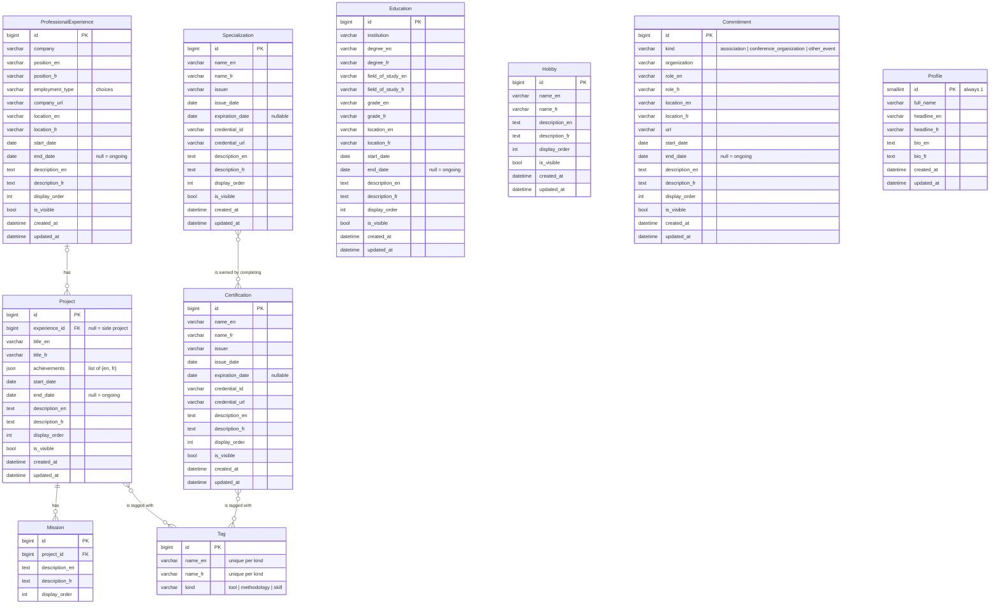

# Database

The portfolio content lives in the `experience` app
([`experience/models.py`](../experience/models.py)), and the owner's profile
in the `owner` app ([`owner/models.py`](../owner/models.py)). Django prefixes
table names with the app label (e.g. `experience_project`, `owner_profile`).

## Entity-relationship diagram


```mermaid
erDiagram
    ProfessionalExperience |o--o{ Project : "has"
    Project ||--o{ Mission : "has"
    Project }o--o{ Tag : "is tagged with"
    Certification }o--o{ Tag : "is tagged with"
    Specialization }o--o{ Certification : "is earned by completing"

    Education {
        bigint id PK
        varchar institution
        varchar degree_en
        varchar degree_fr
        varchar field_of_study_en
        varchar field_of_study_fr
        varchar grade_en
        varchar grade_fr
        varchar location_en
        varchar location_fr
        date start_date
        date end_date "null = ongoing"
        text description_en
        text description_fr
        int display_order
        bool is_visible
        datetime created_at
        datetime updated_at
    }

    ProfessionalExperience {
        bigint id PK
        varchar company
        varchar position_en
        varchar position_fr
        varchar employment_type "choices"
        varchar company_url
        varchar location_en
        varchar location_fr
        date start_date
        date end_date "null = ongoing"
        text description_en
        text description_fr
        int display_order
        bool is_visible
        datetime created_at
        datetime updated_at
    }

    Project {
        bigint id PK
        bigint experience_id FK "null = side project"
        varchar title_en
        varchar title_fr
        json achievements "list of {en, fr}"
        date start_date
        date end_date "null = ongoing"
        text description_en
        text description_fr
        int display_order
        bool is_visible
        datetime created_at
        datetime updated_at
    }

    Mission {
        bigint id PK
        bigint project_id FK
        text description_en
        text description_fr
        int display_order
    }

    Tag {
        bigint id PK
        varchar name_en "unique per kind"
        varchar name_fr "unique per kind"
        varchar kind "tool | methodology | skill"
    }

    Certification {
        bigint id PK
        varchar name_en
        varchar name_fr
        varchar issuer
        date issue_date
        date expiration_date "nullable"
        varchar credential_id
        varchar credential_url
        text description_en
        text description_fr
        int display_order
        bool is_visible
        datetime created_at
        datetime updated_at
    }

    Specialization {
        bigint id PK
        varchar name_en
        varchar name_fr
        varchar issuer
        date issue_date
        date expiration_date "nullable"
        varchar credential_id
        varchar credential_url
        text description_en
        text description_fr
        int display_order
        bool is_visible
        datetime created_at
        datetime updated_at
    }

    Hobby {
        bigint id PK
        varchar name_en
        varchar name_fr
        text description_en
        text description_fr
        int display_order
        bool is_visible
        datetime created_at
        datetime updated_at
    }

    Commitment {
        bigint id PK
        varchar kind "association | conference_organization | other_event"
        varchar organization
        varchar role_en
        varchar role_fr
        varchar location_en
        varchar location_fr
        varchar url
        date start_date
        date end_date "null = ongoing"
        text description_en
        text description_fr
        int display_order
        bool is_visible
        datetime created_at
        datetime updated_at
    }

    Profile {
        smallint id PK "always 1"
        varchar full_name
        varchar headline_en
        varchar headline_fr
        text bio_en
        text bio_fr
        datetime created_at
        datetime updated_at
    }
```

`Profile` stands alone: it describes the owner of the portfolio, not an entry.
`Hobby` and `Commitment` stand alone too: they have no relationship with the other entries.

Many-to-many relationships are stored in join tables that Django creates
automatically (`experience_project_tags`, `experience_certification_tags`,
`experience_specialization_certifications`).

## Tags: tools, methodologies and skills

Tools, methodologies and skills are all rows of the single `Tag` table,
told apart by `kind`. `Tool`, `Methodology` and `Skill` are Django
[proxy models](https://docs.djangoproject.com/en/stable/topics/db/models/#proxy-models):
they have no table of their own, their queries only return tags of their kind,
and saving one sets `kind` automatically.

```python
Tool.objects.create(name_en="Docker", name_fr="Docker")  # stored with kind="tool"
Tool.objects.all()                                       # tools only
project.tags.filter(kind=Tag.Kind.SKILL)                 # a project's skills
Tag.objects.get(name_en="Scrum").certifications.all()    # certifications about Scrum
```

## Abstract base classes

These classes hold shared fields and have no table of their own. Each concrete
model gets its own copy of the fields.

| Base | Fields | Used by |
|---|---|---|
| `BaseEntry` | `description_en`, `description_fr`, `display_order`, `is_visible`, `created_at`, `updated_at` | `Hobby`, and every entry below |
| `DateRangeEntry` (extends `BaseEntry`) | `start_date`, `end_date` | `Education`, `ProfessionalExperience`, `Project`, `Commitment` |
| `CredentialEntry` (extends `BaseEntry`) | `name_en`, `name_fr`, `issuer`, `issue_date`, `expiration_date`, `credential_id`, `credential_url` | `Certification`, `Specialization` |

## Translations

The site is shown in English and French, so every text a visitor reads is
stored in both languages, as one column per language: `title_en` and
`title_fr`. The languages are listed once, in
[`experience/languages.py`](../experience/languages.py).

- **Every language is filled in.** A required text (`degree`, `position`,
  `title`, `name`, `role`) is required in each language. An optional text
  (`field_of_study`, `grade`, `location`, `description`) is either filled in
  every language or empty in all of them (the profile's `bio` too): a check
  constraint per field
  (`translated_together()` in [`models.py`](../experience/models.py)) refuses
  anything else, so the rule holds for every writer.
- **List items are translated one by one.** A project's `achievements` is a
  JSON list of `{"en": ..., "fr": ...}` objects (a model validator refuses any
  other shape, in the Django admin too), and each `Mission` has a
  `description_en` and a `description_fr`.
- **Tag names are unique within their kind, in each language**: one unique
  constraint on `(name_en, kind)`, another on `(name_fr, kind)`.
- **Not translated**: proper nouns (`institution`, `company`, `organization`, `issuer`),
  `credential_id`, URLs, dates and codes (`employment_type` and `kind`, which
  the frontend labels in the visitor's language).
- **The APIs hide the columns.** Both APIs expose a translated field under
  its plain name as `{"en": ..., "fr": ...}` (see [api.md](api.md)), through
  `LocalizedField` in [`localized.py`](../experience/localized.py).
- **Content from before the translation was kept.** The migrations
  (`0003` to `0007`, built with
  [`migrations/_translation.py`](../experience/migrations/_translation.py))
  renamed each column to its `_en` version and copied it to `_fr`, to be
  translated in the admin.

Why columns rather than a JSON object per field or a translation table:
there are two fixed languages, the Django admin shows each column as a
plain input, and the database can check each column.

## Design decisions

- **Education, certifications and professional experience are separate tables.**
  Each kind of entry has its own fields, so a single table with a `type` column
  would leave most columns empty.
- **A null `end_date` means the entry is ongoing.** There is no separate flag to
  keep in sync; the `is_current` property is computed from it.
- **Specializations are their own table.** A specialization certificate is
  earned after completing every certification on its path. The link is stored
  on the specialization side, so earning one only means creating the
  specialization and choosing its certifications, and a certification can be part
  of several paths.
- **Tools, methodologies and skills are one `Tag` table with a `kind`.** Each
  tag is created once and reused across projects and certifications, so both
  only need a single `tags` relation, and everything related to a given tag can
  be queried. The same name may exist under two kinds (e.g. "Python" as a tool
  and as a skill).
- **A project without a professional experience is a side project** (e.g. this
  portfolio). Side projects use the same fields, tags and missions as work
  projects; query them with `Project.objects.filter(experience__isnull=True)`.
- **Hiding an experience hides its projects.** The API only exposes a project
  when it is visible and is either a side project or belongs to a visible
  experience, wherever projects appear (`projects/`, an experience's detail, a
  tag's detail). The rule lives in `visible_projects()` in
  [`experience/views.py`](../experience/views.py).
- **Missions belong to a single project** (foreign key); deleting a project or
  an experience also deletes the rows under it.
- **Achievements (valorization elements) are a JSON list** of translated
  texts on the project instead of a separate table.
- **Date order is enforced by the database.** Check constraints refuse an
  `end_date` before the `start_date` and an `expiration_date` before the
  `issue_date`, so the rule holds for every writer. The Django admin reports it
  as a form error, and the [admin API](admin_api.md) as a `400` on the end
  field.
- **`display_order` and `is_visible`** control what the frontend shows and in
  which order without deleting data.
- **The profile is a single row.** There is one owner, so `Profile` has a
  fixed id (`1`) and a check constraint refusing any other: a second profile
  is refused by the database. It has no `is_visible` or `display_order`, and
  its own `owner` app, as it is not a portfolio entry.
